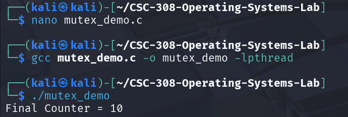
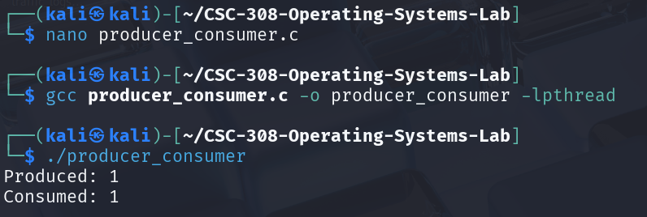
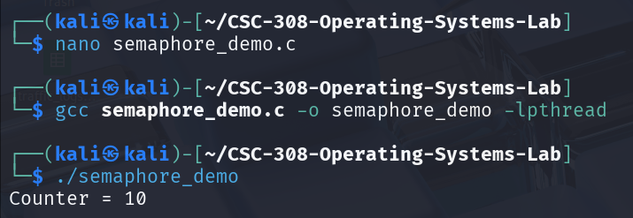
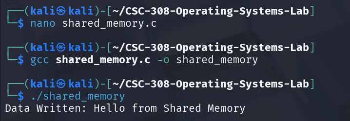

# CSC308 – Operating Systems Practicals

Process synchronization and Inter-Process Communication (IPC) implementations in C using POSIX threads and semaphores.


---

## 📁 Project Structure

```
CSC308-OS-Practicals/
├── session1-mutex/
│   └── mutex_demo.c
├── session2-producer-consumer/
│   └── prod_cons.c
├── session3-semaphores/
│   └── semaphore_impl.c
├── session4-shared-memory/
│   └── shared_mem.c
├── screenshots/
│   ├── mutex_output.png
│   ├── prod_cons_output.png
│   ├── semaphore_output.png
│   └── shared_mem_output.png
└── README.md
```

---

## Session Breakdown

### Session 1 – Mutex Lock Demonstration
- **Objective:** Demonstrate mutual exclusion using pthread mutex locks
- Multiple threads increment a shared counter
- Shows the difference between running WITH and WITHOUT a mutex
- **Key Functions:** `pthread_mutex_init`, `pthread_mutex_lock`, `pthread_mutex_unlock`, `pthread_mutex_destroy`
- **Expected Result:** With mutex, counter = number of threads. Without mutex, counter < expected (non-deterministic)

### Session 2 – Producer-Consumer Simulation
- **Objective:** Implement the Producer-Consumer problem using POSIX semaphores
- Uses a circular buffer with fixed size
- Producer generates items, consumer consumes them
- Semaphores used: `mutex (1)`, `empty (N)`, `full (0)`
- **Key Functions:** `sem_init`, `sem_wait`, `sem_post`, `sem_destroy`

### Session 3 – Semaphore Implementation in C
- **Objective:** Compare mutex locks and semaphores for protecting shared resources
- Protects a shared counter using `sem_wait()`/`sem_post()`
- Experiments with counting semaphores (allowing 3 threads simultaneously)
- **Key Takeaway:** Semaphores are more flexible (counting), but mutexes are simpler for binary exclusion
- **Key Functions:** `sem_init`, `sem_wait`, `sem_post`

### Session 4 – Shared Memory Programming
- **Objective:** Implement inter-process communication using shared memory
- Parent and child processes share a memory segment
- Semaphores used to synchronize access
- Cleanup handled with `shmdt()` and `shmctl(IPC_RMID)`
- **Key Functions:** `shmget`, `shmat`, `shmdt`, `shmctl`
- **Real-world Applications:** Database servers, Web servers, Scientific computing, Real-time systems

---


## 📸 Screenshots

### Session 1 – Mutex Output


### Session 2 – Producer-Consumer Output


### Session 3 – Semaphore Output


### Session 4 – Shared Memory Output



---

## 👨🏽‍💻 Author

**Nwachukwu Divinefavour Dabere**  
Computer Science, 300 Level - Nnamdi Azikiwe University
